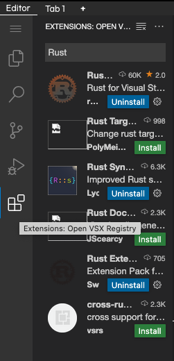
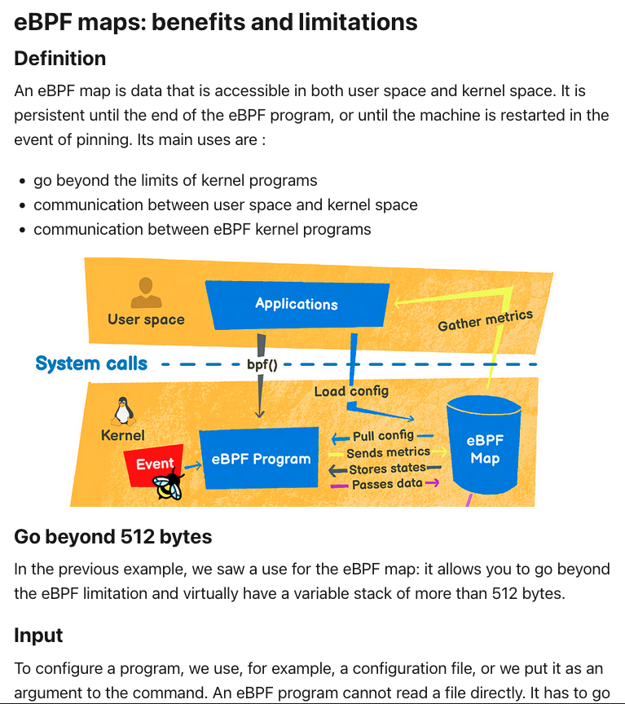

Before using eBPF maps with Aya, you need to install dependancies. I created an Docker Image for that to save time.

<br>


In this lab, you only can use **Editor** tab. The project directory is `tracepoint-binary`.

Launch this command in the Terminal at the bottom:

```plain
docker run --rm -it --name aya \
                    --privileged \
                    --network host \
                    -e USER=littlejo \
                    -e RUST_LOG=info \
                    -v /:/host \
                    -v /sys/kernel/debug:/sys/kernel/debug \
                    littlejo/aya:slim bash
```{{exec}}

* It can take a long time. During this time, you can install Rust extensions (in the OPEN VSX Registry) for the Editor:
  * Rust
  * Rust Syntax
  * Rust Extension Pack

Like that, in Rust code, you will see coloration of syntax.


If you have time, you also can read the article: CHANGE_ME


