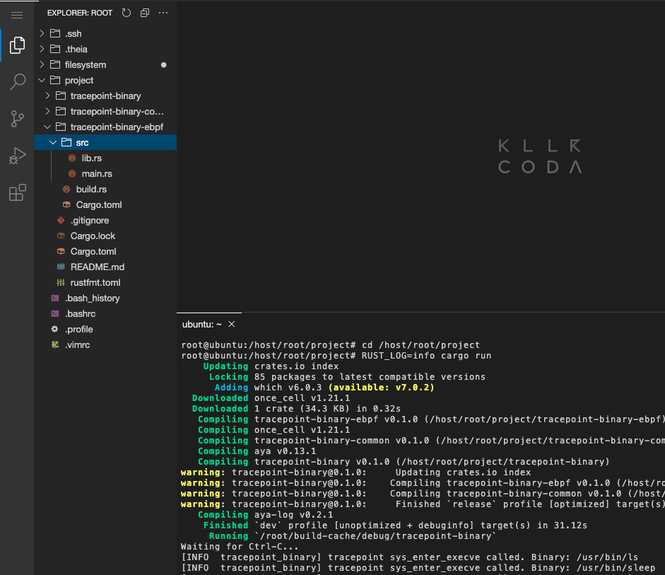
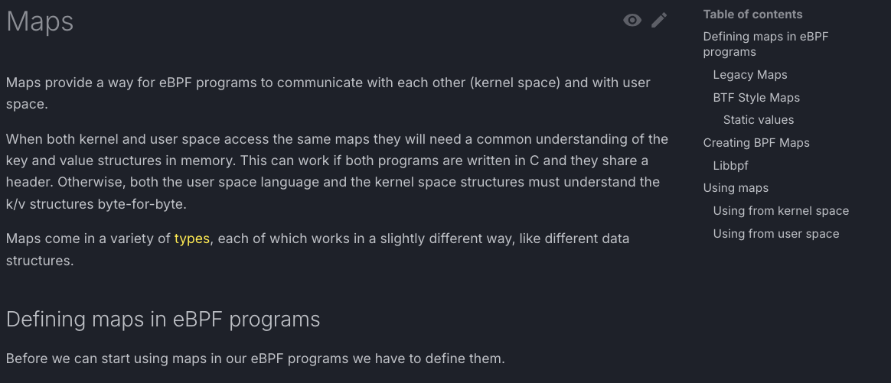
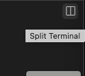
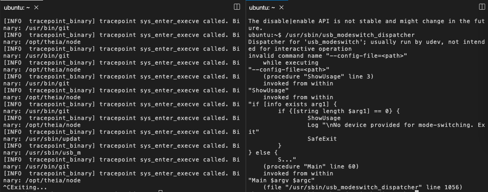

Test the eBPF program before making any modifications... In the container, run these commands:

```plain
cd /host/root/project
RUST_LOG=info cargo run
```{{exec}}



* It can take a long time. In addition to [the article](https://dev.to/littlejo/enhancing-your-aya-program-with-ebpf-maps-4hdj), you also can read [documentation about eBPF maps](https://docs.ebpf.io/linux/concepts/maps/):



* When you see: "Waiting for Ctrl-C...", You must see on the terminal:
```plain
[INFO  aya_test] tracepoint sys_enter_execve called Binary: $NAME_OF_BINARY
```

* You can click on this icon to split terminal:



* On another terminal, launch:

```plain
/usr/sbin/update-rc.d
/usr/sbin/usb_modeswitch_dispatcher
```{{exec}}

* On the editor tab, you must see a bug.


