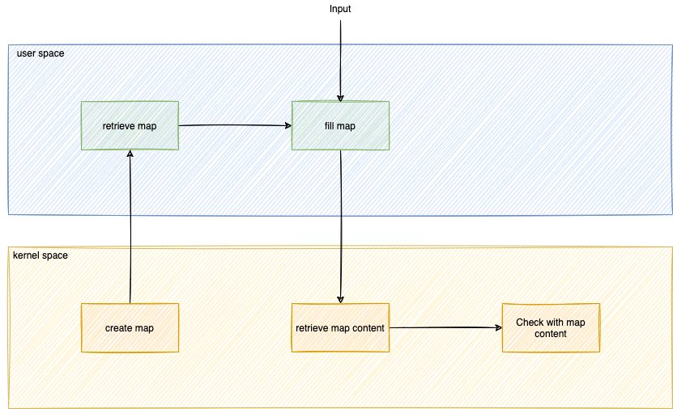

You need to add a new feature: create a filter to exclude logs from certain binaries:
* `/usr/bin/ls`
* `/usr/bin/sleep`

How to do this ?

* Kernel environment: Create an eBPF map with the list of binaries
* User environment: Retrieve the map
* User environment: Fill up the eBPF map with input
* Kernel environment: Retrieve the map content
* Kernel environment: Create a check if the binary is in the map content

