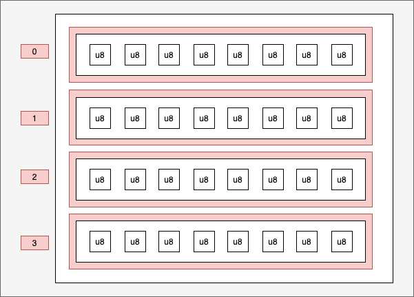
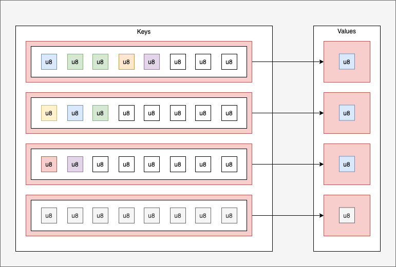

Now you have to Create an eBPF map with the list of binaries

For that, we have to think which type of eBPF map we have to choose.

There are 2 types of eBPF for configuration (just one write and many reads):
* Array of list of binaries:  `Array<[u8; 512]>`



* HashMap of list of binaries in key: `HashMap<[u8; 512], u8>`



Array is not a good option for the check if binary is in the list because it's **O(n)**
HashMap is the good option because for the check if binary is in the hashmap is in **O(1)**

You have to add this line with the other map in the `/root/tracepoint-binary/tracepoint-binary-ebpf/src/main.rs` file:
```rust
#[map]
static EXCLUDED_CMDS: HashMap<[u8; 512], u8> = HashMap::with_max_entries(10, 0);
```{{copy}}

You need to add library:
```rust
use aya_ebpf::maps::HashMap;
```{{copy}}

* Now it should be compiled:
```bash
cd /host/root/tracepoint-binary
RUST_LOG=info cargo run
```{{exec interrupt}}

Nothing changed for the log! You just created a map. That's all!
