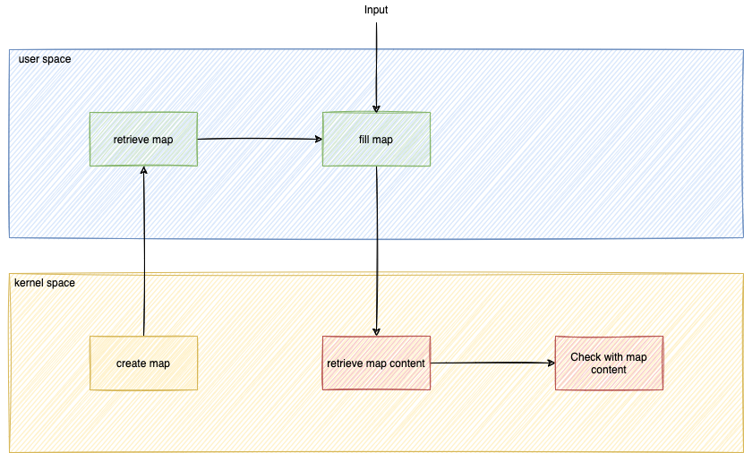

Now you have to create a check in the **kernel environment** if the binary is in the list

For that, we have to modify this file: `tracepoint-binary-ebpf/src/main.rs`

* Add these lines:
```rust
if EXCLUDED_CMDS.get(& *buf).is_some() {
           info!(&ctx, "No log for this Binary");
           return Ok(0);
}
```{{copy}}

before this lines: `from_utf8_unchecked(filename_bytes)`

* Now it should be compiled:
```bash
cd /host/root/tracepoint-binary
RUST_LOG=info cargo run
```{{exec}}

* It can work but not totally:
```
[INFO  tracepoint_binary] No log for this Binary
[INFO  tracepoint_binary] No log for this Binary
[INFO  tracepoint_binary] tracepoint sys_enter_execve called. Binary: /usr/bin/git
[INFO  tracepoint_binary] No log for this Binary
[INFO  tracepoint_binary] tracepoint sys_enter_execve called. Binary: /usr/bin/git
[INFO  tracepoint_binary] No log for this Binary
[INFO  tracepoint_binary] tracepoint sys_enter_execve called. Binary: /usr/bin/git
```
* Did you find the bug?
