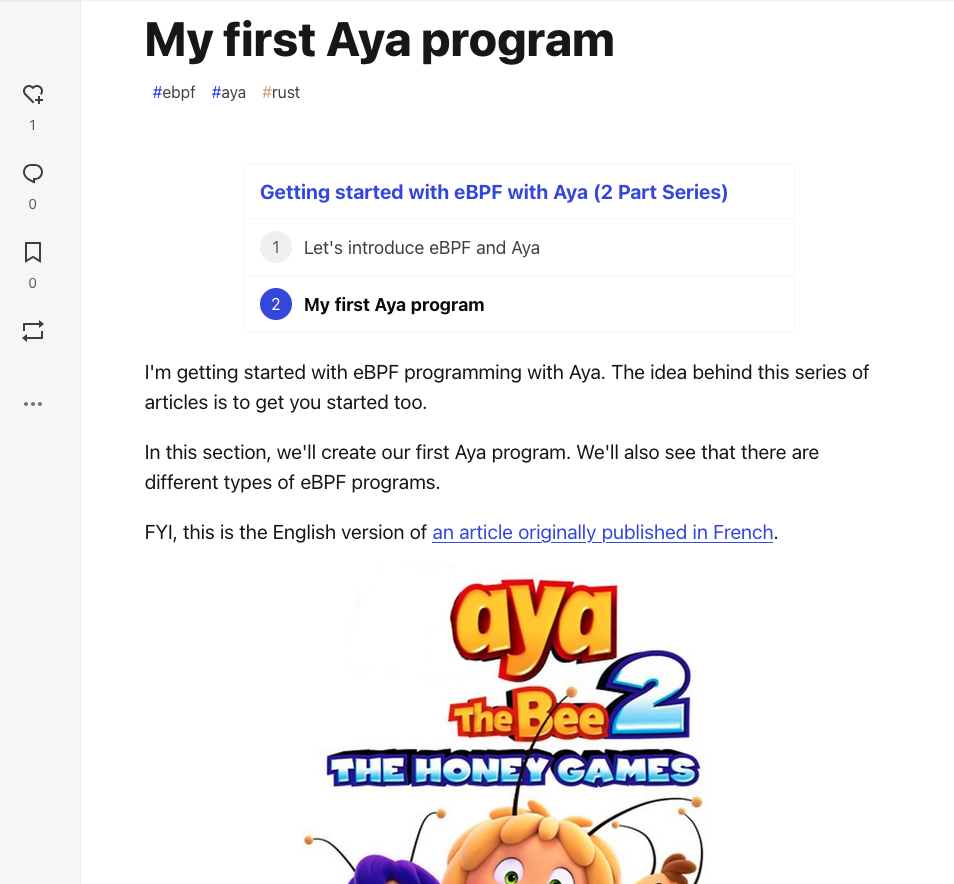

Before coding an eBPF program with Aya, you need to install dependancies. I created a Docker Image for that to save time.

<br>

In this tutorial, you only can use **Editor** tab.

Launch this command in the Terminal at the bottom:

```sh
docker run --rm -it --name aya \
                    --privileged \
                    --network host \
                    -w /host/root/ \
                    -v /:/host \
                    -v /sys/kernel/debug:/sys/kernel/debug \
                    littlejo/aya:1.0.0 bash
```{{exec}}

* It can take a long time. During this time, you can install Rust extensions (in the OPEN VSX Registry) for the Editor:
  * Rust
  * Rust Syntax
  * Rust Extension Pack

Like that, in Rust code, you will see coloration of syntax.


If you have time, you can also read the article: [My first Aya program](https://dev.to/littlejo/my-first-aya-program-2j0p).


