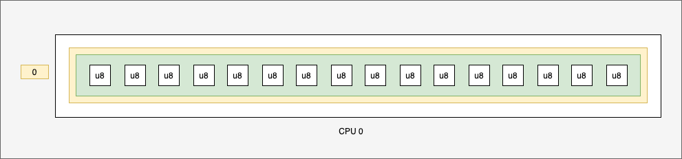
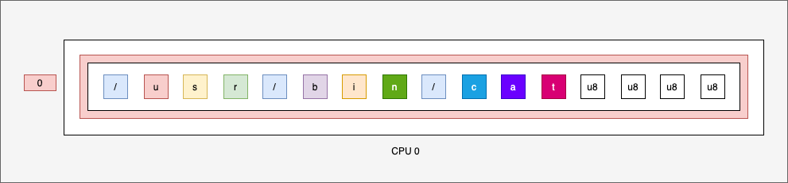
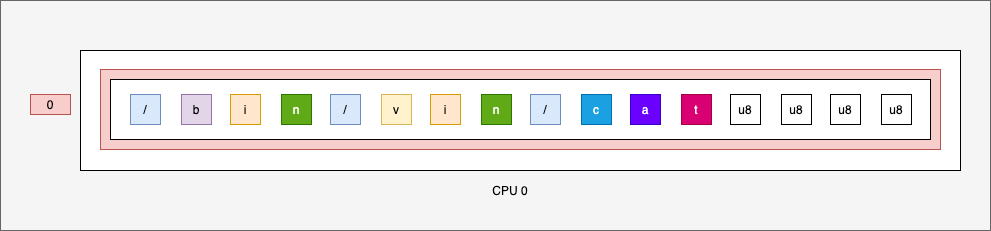

So what is the problem?

* At the beginning of the program, the buffer map is filled of zeros:

* After one command, the buffer map is not filled of zeros but with the commands + zeros:

* After the second command, if the length of first command is greater than the second command, the buffer map is filled of the second commands + the last of the first commands + zeros:

So you need to find a solution to reset the buffer before each launching. The type of the buffer can't do that. So you need to change with a Hash map.
