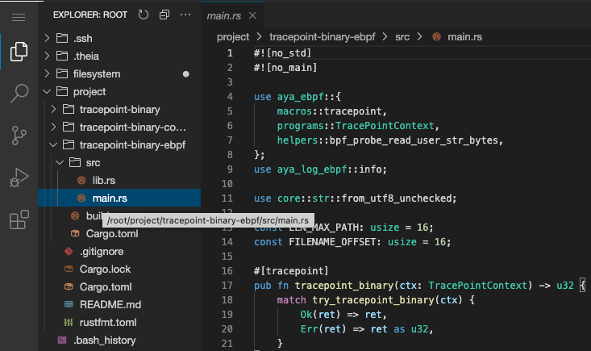

Now you have to improve the code to fix the issue of truncated filenames. Indeed, filename only have 15 characters maximum.

For that, you need to modify **kernel space** of eBPF program.

To edit the code, you need a text editor. You can use the **Editor** tab:
* Select the `project` directory
* Navigate to `tracepoint-binary-ebpf/src/main.rs`




* Modify this line:
```rust
const LEN_MAX_PATH: usize = 16;
```

Test with the value of **512**.

In the container, stop the Aya program (with CTRL-C) and run these commands:

```plain
cd /host/root/project
RUST_LOG=info cargo run
```{{exec interrupt}}

* You should see an error:
> ERROR llvm: <unknown>:0:0: in function tracepoint_binary i32 (ptr): Looks like the BPF stack limit is exceeded. Please move large on stack variables into BPF per-cpu array map. For non-kernel uses, the stack can be increased using -mllvm -bpf-stack-size.
* Why ?

The memory stack for eBPF is limited to 512 bytes. In other words, the sum of all variables cannot exceed 512 bytes.


Solution: an eBPF Map can help you!
