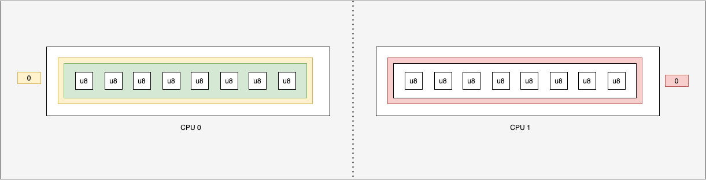
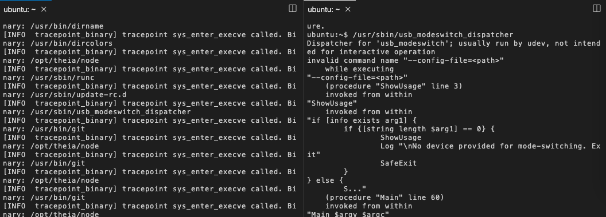

You need to modify your code to use the map. You have to modify kernel space program: `aya-test-ebpf/src/main.rs`.
To access to the eBPF map created. In the [documentation](https://docs.rs/aya-ebpf/latest/aya_ebpf/maps/per_cpu_array/struct.PerCpuArray.html), you have 3 different methods:

```rust
pub fn get(&self, index: u32) -> Option<&T>
pub fn get_ptr(&self, index: u32) -> Option<*const T>
pub fn get_ptr_mut(&self, index: u32) -> Option<*mut T>
```

You need to replace this code:
```rust
let mut buf = [0u8; LEN_MAX_PATH];
```

So you need mutable access. So `get_ptr_mut()` method is good for that.



Change with that:

```rust
let buf = BUF.get_ptr_mut(0).ok_or(0)?;
```{{copy}}

so the type of buf is `*mut [u8; LEN_MAX_PATH]`. It's quite different from previously.

You need to deference this variable. So you have add a `*` to `buf`. For that, you need to modify this line :
```rust
let filename_bytes = bpf_probe_read_user_str_bytes(filename_src_addr, &mut buf)?;
```
with this code:

```rust
let filename_bytes = bpf_probe_read_user_str_bytes(filename_src_addr, &mut *buf)?;
```{{copy}}

* Now it should be compiled and work:
```bash
cd /host/root/tracepoint-binary
RUST_LOG=info cargo run
```{{exec interrupt}}

* You can test it! On another terminal, launch:

```plain
/usr/sbin/update-rc.d
/usr/sbin/usb_modeswitch_dispatcher
```{{exec}}


