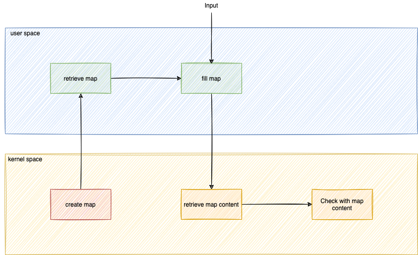
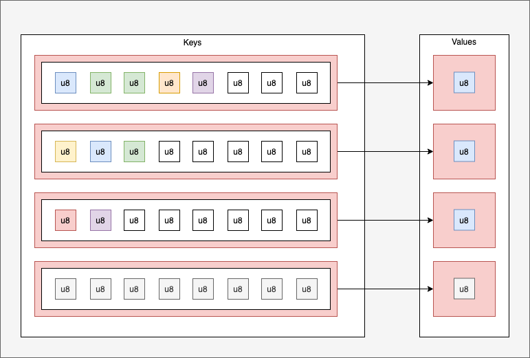

Now you have to create an eBPF map with the list of binaries

For that, we have to think which type of eBPF map we have to choose.

There are 2 types of eBPF maps for configuration (just one write and many reads):
* Array of list of binaries:  `Array<[u8; 512]>`


* HashMap of list of binaries in key: `HashMap<[u8; 512], u8>`



Using an array to check if a binary is in the list is inefficient because it requires a loop, making it **O(n)**. A HashMap is a better choice, as lookups are **O(1)**.

You have to add this line after the other map in the `tracepoint-binary-ebpf/src/main.rs` file:
```rust
#[map]
static EXCLUDED_CMDS: HashMap<[u8; LEN_MAX_PATH], u8> = HashMap::with_max_entries(10, 0);
```{{copy}}

You need to add library:
```rust
use aya_ebpf::maps::HashMap;
```{{copy}}

* Now it should be compiled:
```bash
cd /host/root/project
RUST_LOG=info cargo run
```{{exec interrupt}}

Nothing changed for the log! You just created a map. That's all!
