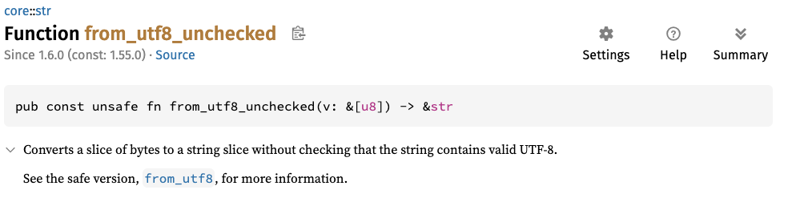
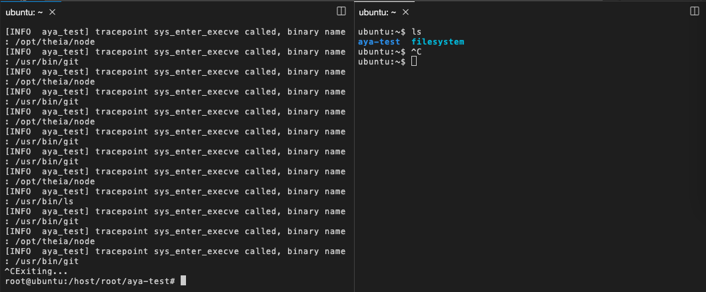

Now you have to convert the filename bytes into filename string

You have to modified kernel space program: `aya-test-ebpf/src/main.rs`

Particularly this code:
```rust
fn try_test_aya(ctx: TracePointContext) -> Result<u32, i64> {
    let _filename_src_addr = unsafe {ctx.read_at::<*const u8>(16)?};
    let mut buf = [0u8; 16];
    let _filename_bytes :&[u8] = unsafe { aya_ebpf::helpers::bpf_probe_read_user_str_bytes(filename_src_addr, &mut buf)? };
    //you have to add something here
    info!(&ctx, "tracepoint sys_enter_execve called {:x} {:x}", _filename_src_addr as u32, _filename_bytes);
    Ok(0)
}
```

You can use the `from_utf8_unchecked` function. For more information about this function, you can read the [documentation](https://doc.rust-lang.org/core/str/fn.from_utf8_unchecked.html).



<br>

```rust
let filename = unsafe { core::str::from_utf8_unchecked(_filename_bytes) };
```{{copy}}

You can change info log like that now:
```rust
info!(&ctx, "tracepoint sys_enter_execve called, binary name: {}", filename);
```{{copy}}

* Now you can test:

```bash
cargo run
```{{exec interrupt}}

* When you see: "Waiting for Ctrl-C..."
* Now you can see all binaries launch on the machine:
```plain
[INFO  aya_test] tracepoint sys_enter_execve called, binary name : /usr/bin/git
[INFO  aya_test] tracepoint sys_enter_execve called, binary name : /opt/theia/node
```
* On another terminal, launch shell command like `ls`.

* You must see on the "cargo run" terminal something like:
```plain
[INFO  aya_test] tracepoint sys_enter_execve called, binary name: /usr/bin/ls
```


