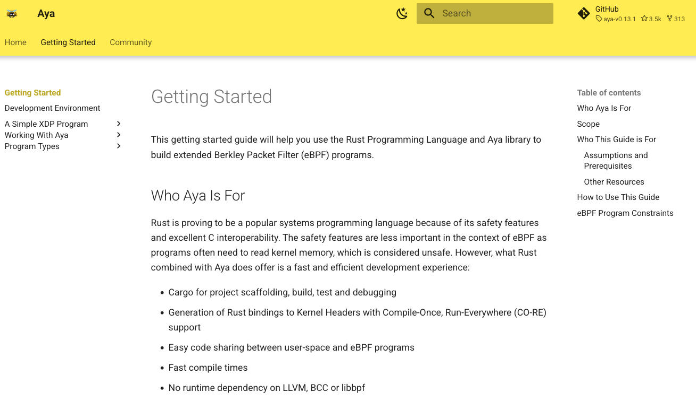

Aya requires some new features in Rust, so you need to configure Rust to enable them.

You need to launch these commands:

```plain
rustup default stable
rustup toolchain add nightly
rustup component add rust-src --toolchain nightly
```{{exec}}

* It can take a long time. During this time, you can read the [Aya book](https://aya-rs.dev/book/).


