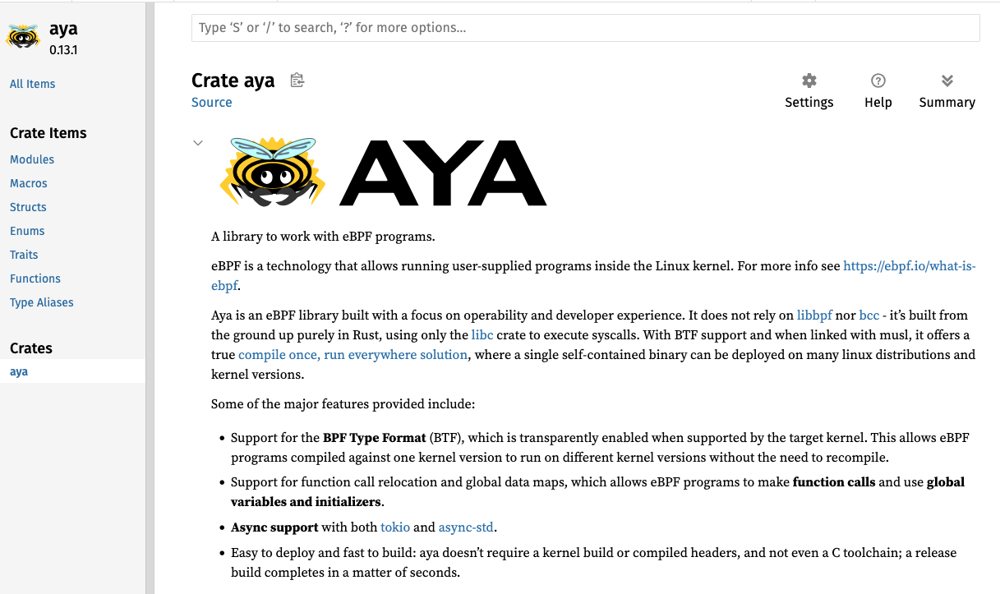

You also need to install the dependencies cargo-generate and bpf-linker:

```plain
cargo install cargo-generate bpf-linker
```{{exec}}

Some other resources are very important to learn Aya:
* [Documentation of Aya in the kernel side](https://docs.rs/aya-ebpf/latest/aya_ebpf/)
* [Documentation of Aya in the user side](https://docs.rs/aya/latest/aya/)


