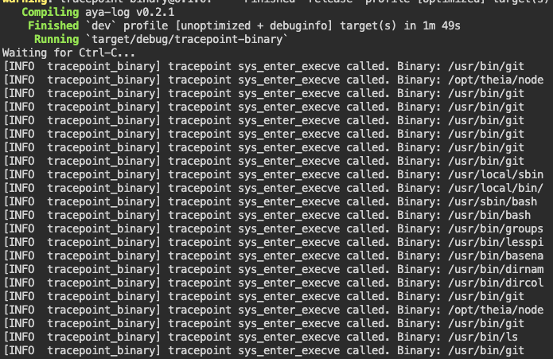

Verify the installation with an example.

Run the following command to execute the example:
```plain
git clone https://github.com/littlejo/aya-examples
cd aya-examples/tracepoint-binary
```{{exec}}

* Compile and run the project:

```plain
RUST_LOG=info cargo run
```{{exec}}

On another terminal, run:
```plain
ls
```{{exec}}

* Observe the output in the first terminal to see what happens.


