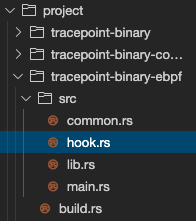

To further organize your code, move the main logic from `main.rs` into a new file called `hook.rs`:

```rust
use aya_ebpf::{
    helpers::bpf_probe_read_user_str_bytes,
    macros::tracepoint,
    programs::TracePointContext,
};

use aya_log_ebpf::info;
use core::str::from_utf8_unchecked;
use crate::common::*;
const FILENAME_OFFSET: usize = 16;

#[tracepoint]
pub fn tracepoint_binary(ctx: TracePointContext) -> u32 {
    match try_tracepoint_binary(ctx) {
        Ok(ret) => ret,
        Err(ret) => ret as u32,
    }
}

fn try_tracepoint_binary(ctx: TracePointContext) -> Result<u32, i64> {
    let buf = BUF.get_ptr_mut(0).ok_or(0)?;
    let filename = unsafe {
        *buf = ZEROED_ARRAY;
        let filename_src_addr = ctx.read_at::<*const u8>(FILENAME_OFFSET)?;
        let filename_bytes = bpf_probe_read_user_str_bytes(filename_src_addr, &mut *buf)?;
        if EXCLUDED_CMDS.get(&*buf).is_some() {
            info!(&ctx, "No log for this Binary");
            return Ok(0);
        }
        from_utf8_unchecked(filename_bytes)
    };
    info!(
        &ctx,
        "tracepoint sys_enter_execve called. Binary: {}", filename
    );
    Ok(0)
}
```{{copy}}

Then, clean up `main.rs` so that it only contains the necessary module declarations and panic handler:

```rust
#![no_std]
#![no_main]

mod common;
mod hook;

#[cfg(not(test))]
#[panic_handler]
fn panic(_info: &core::panic::PanicInfo) -> ! {
    loop {}
}
```{{copy}}

Finally, make sure your code compiles successfully:

```plain
cd /host/root/project
cargo run
```{{exec interrupt}}

Now, your code is cleaner and better structured, making it easier to implement tail calls efficiently. 
