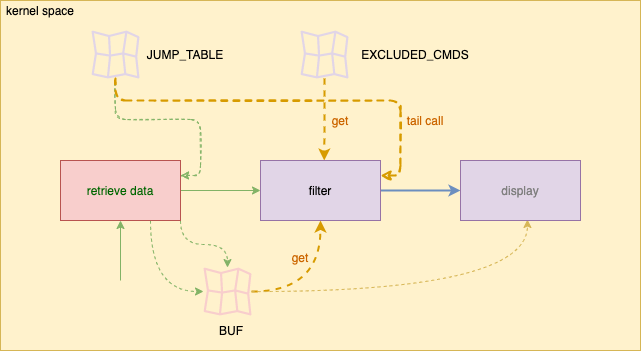
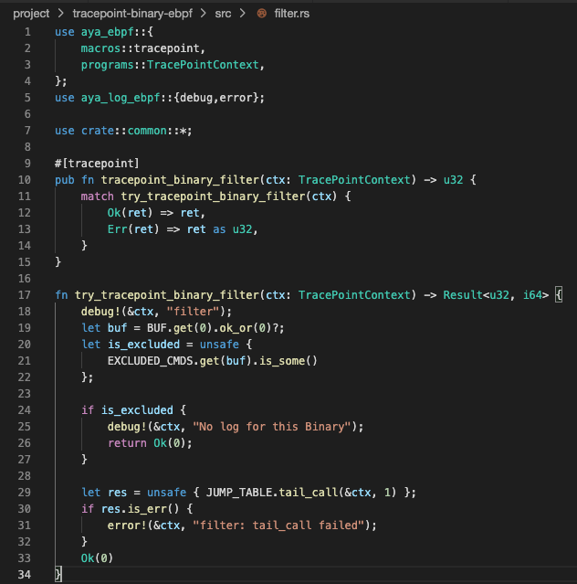

The goal of `filter.rs` is to prevent to display some binaries. So, you need to clean up `filter.rs`.

### Update the `try_tracepoint_binary_filter` function

You should have the following code in your `filter.rs` file for the main function:

```rust
fn try_tracepoint_binary_filter(ctx: TracePointContext) -> Result<u32, i64> {
    debug!(&ctx, "filter");
    let buf = BUF.get(0).ok_or(0)?;

    let is_excluded = unsafe {
        EXCLUDED_CMDS.get(buf).is_some()
    };

    if is_excluded {
        debug!(&ctx, "No log for this Binary");
        return Ok(0);
    }

    Ok(0)
}
```{{copy}}

### Add a jump to the display program 

Next, you need to add a tail call to the display program:

```rust
let res = unsafe { JUMP_TABLE.tail_call(&ctx, 1) };
if res.is_err() {
    error!(&ctx, "filter: tail_call failed");
}
```{{copy}}

Insert this code before `Ok(0)`.

Also, **import the required library**:

```rust
use aya_log_ebpf::{debug,error};
```{{copy}}

### Clean up unused imports 

As part of cleanup, don't forget to remove any unnecessary imports from the top of the file.



### Compile and run the code

Finally, ensure your code compiles successfully:

```plain
cd /host/root/project
RUST_LOG=debug cargo run
```{{exec interrupt}}

Now, your `filter.rs` is clean and only contains the essential logic to interact with the display program.
