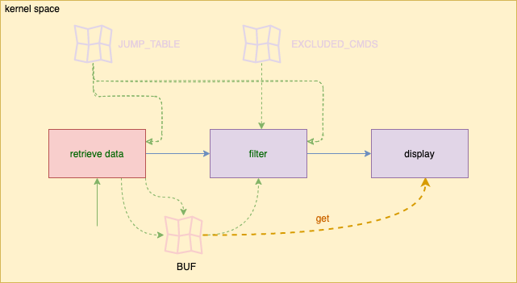
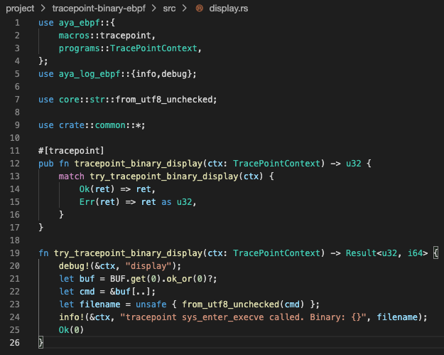

The goal of `display.rs` is to display binaries. So, you need to clean up `display.rs`.

### Update the `try_tracepoint_binary_display` function

You should have the following code in your `display.rs` file for the main function:

```rust
fn try_tracepoint_binary_display(ctx: TracePointContext) -> Result<u32, i64> {
    debug!(&ctx, "display");
    let buf = BUF.get(0).ok_or(0)?;
    let cmd = &buf[..];
    let filename = unsafe { from_utf8_unchecked(cmd) };
    info!(&ctx, "tracepoint sys_enter_execve called. Binary: {}", filename);
    Ok(0)
}
```{{copy}}

Also, **import the required library**:

```rust
use aya_log_ebpf::{info,debug};
```{{copy}}

### Clean up unused imports 

As part of cleanup, don't forget to remove any unnecessary imports from the top of the file.



### Compile and run the code

Finally, ensure your code compiles successfully:

```plain
cd /host/root/project
RUST_LOG=debug cargo run
```{{exec interrupt}}
