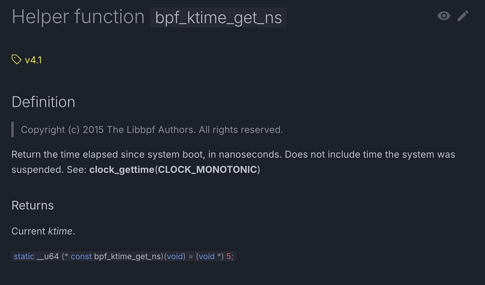

Now that we've created a second eBPF program, let's play with the first. Let's take a look at how to calculate the time taken by a syscall execve between its input (`sys_enter_execve`) and its output (`sys_exit_execve`).

You need a helper function to create a timer.

`bpf_ktime_get_ns()` is a helper function to get timestamp in nanoseconds.



To use it, you need to add

```rust
use aya_ebpf_bindings::helpers::bpf_ktime_get_ns;
```{{copy}}

Let's add this function on `hook.rs` and `hook_exit.rs`:

```rust
let t = unsafe{ bpf_ktime_get_ns() };
debug!(&ctx, "hook {}", t);
```{{copy}}

```rust
let t = unsafe{ bpf_ktime_get_ns() };
debug!(&ctx, "hook_exit {}", t);
```{{copy}}

Also add if necessary:
```rust
use aya_log_ebpf::debug;
```{{copy}}

Let's test:

```
RUST_LOG=debug cargo run
```{{exec interrupt}}

We forgot to tell to cargo to pull ebpf binding library. In the `tracepoint-binary-ebpf/Cargo.toml` file (Category dependencies), you need to add:
```Toml
aya-ebpf-bindings = "0.1.1"
```{{copy}}

Let's test again:

```
RUST_LOG=debug cargo run
```{{exec interrupt}}


