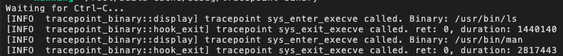

So you need to create a LruHashMap map. The key is a tgid:

```rust
let tgid = (bpf_get_current_pid_tgid() >> 32) as u32;
```{{copy}}

You also need library:
```rust
use aya_ebpf::helpers::bpf_get_current_pid_tgid;
```{{copy}}

To create LruHashMap map, you need to add this map on `common.rs`:

```rust
#[map]
pub static T_ENTER: LruHashMap<u32, u64> = LruHashMap::with_max_entries(16, 0);
```{{copy}}

Don't forget to add library for this map:
```rust
use aya_ebpf::{
    macros::map,
    maps::{HashMap, PerCpuArray, ProgramArray, LruHashMap},
    programs::TracePointContext,
};
```{{copy}}


To fill the map, you need to add this on `hook.rs`:
```rust
let tgid = (bpf_get_current_pid_tgid() >> 32) as u32;
T_ENTER.insert(&tgid, &t, 0)?;
```{{copy}}

To retrieve the content of the map, you need to add this on `hook_exit.rs`:

```rust
let tgid = (bpf_get_current_pid_tgid() >> 32) as u32;
let t_enter = unsafe { T_ENTER.get(&tgid).ok_or(0)? };
```{{copy}}

Don't forget to add library to access to this map:

```rust
use crate::common::*;
```{{copy}}

Now you can have the duration on `hook_exit.rs`:

```rust
info!(&ctx, "tracepoint sys_exit_execve called. ret: {}, duration: {}", ret, t - t_enter);
```{{copy}}

Now you can test:
```
cargo run
```{{exec interrupt}}

You should have something like that:



Now you have the duration of each command.
