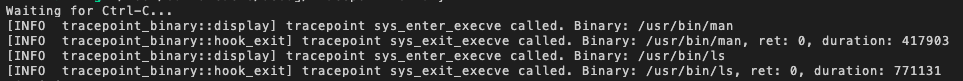

## Hook exit

Now hook_exit program can retrieve the `BUF` map and display the content (like you did in the display program).

You need to add theses lines:
```rust
let buf = unsafe { BUF.get(&tgid).ok_or(0)? };
let cmd = &buf[..];
let filename = unsafe { from_utf8_unchecked(cmd) };
```{{copy}}

And replace this line:
```rust
info!(&ctx, "tracepoint sys_exit_execve called. ret: {}, duration: {}", ret, t - t_enter);
```

by:
```rust
info!(&ctx, "tracepoint sys_exit_execve called. Binary: {}, ret: {}, duration: {}", filename, ret, t - t_enter); //CHANGE
```{{copy}}

You will have:

```rust
fn try_tracepoint_binary_exit(ctx: TracePointContext) -> Result<u32, i64> {
    let t = unsafe{ bpf_ktime_get_ns() };
    let tgid = (bpf_get_current_pid_tgid() >> 32) as u32;
    let t_enter = unsafe { T_ENTER.get(&tgid).ok_or(0)? };
    let buf = unsafe { BUF.get(&tgid).ok_or(0)? }; //ADD
    let cmd = &buf[..]; //ADD
    let filename = unsafe { from_utf8_unchecked(cmd) }; //ADD
    let ret :i64 = unsafe { ctx.read_at(16)? };
    debug!(&ctx, "exit {}", t);
    info!(&ctx, "tracepoint sys_exit_execve called. Binary: {}, ret: {}, duration: {}", filename, ret, t - t_enter); //CHANGE
    Ok(0)
}
```{{copy}}

You also need this library:

```rust
use core::str::from_utf8_unchecked;
```{{copy}}

Let's test:

```
RUST_LOG=info cargo run
```{{exec interrupt}}

If you test, you'll see something like that:



Congrats! You succeeded to create tracing of each command.
