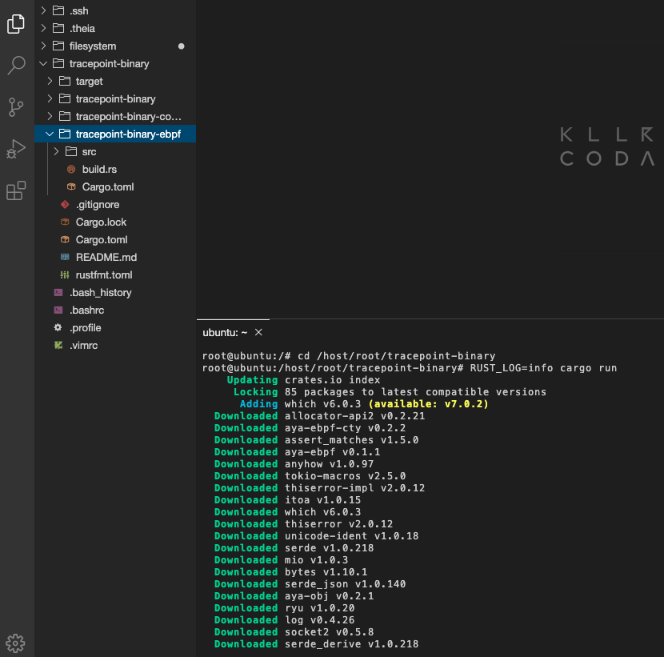

Test the eBPF program before making any modifications... In the container, run these commands:

```plain
cd /host/root/project
RUST_LOG=debug cargo run
```{{exec}}



* When you see: "Waiting for Ctrl-C...", You must see on the terminal, something like:
```plain
[DEBUG tracepoint_binary::hook] hook
[DEBUG tracepoint_binary::filter] filter
[DEBUG tracepoint_binary::filter] No log for this Binary
```
