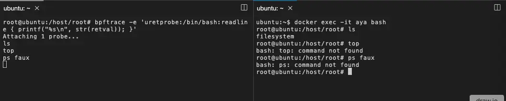

<br>

bpftrace is installed on the container. You can test it:

For example:

```plain
bpftrace -e \
'uretprobe:/bin/bash:readline { printf("%s\n", str(retval)); }'
```{{exec}}

This program should print what you write on bash in the terminal

Open another terminal with split:

Let type some commands: It doesn't work because you're not in the container and the `hook` /bin/bash is in the container.

So you need connect to the container:

```plain
docker exec -it aya bash
```{{exec}}

Now you can see what you write on bash in the container:

