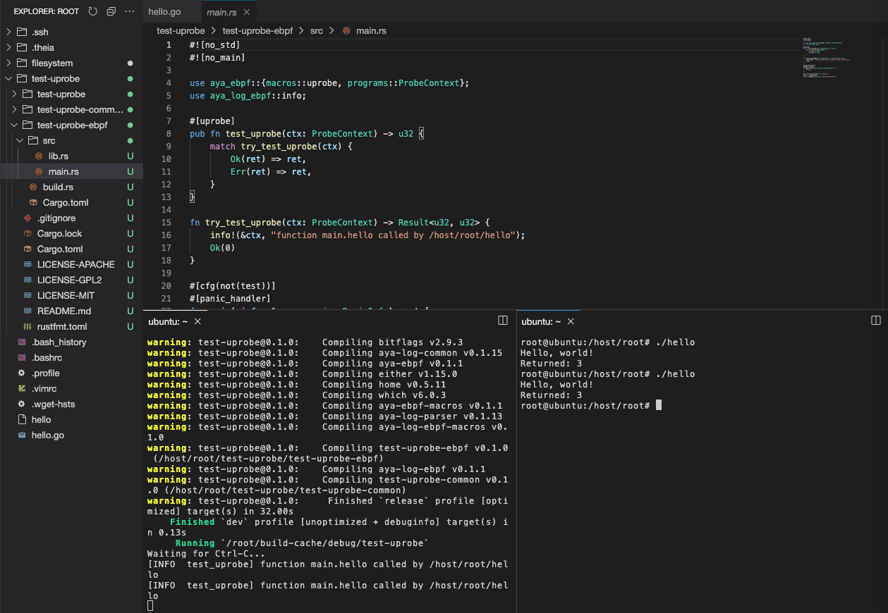

## In the container

Define some variables, for example:

```fish
name=test-uprobe
program_type=uprobe
target=/host/root/hello
fn_name=main.hello
```{{exec}}

And launch:

```fish
cd /host/root/
cargo generate --name $name \
               -d program_type=$program_type \
               -d uprobe_target=$target \
               -d uprobe_fn_name=$fn_name \
               https://github.com/aya-rs/aya-template

```{{exec}}

The Aya uprobe program is generated. Now you have to compile and install:
```fish
cd $name
cargo run
```{{exec}}

The work can start...

