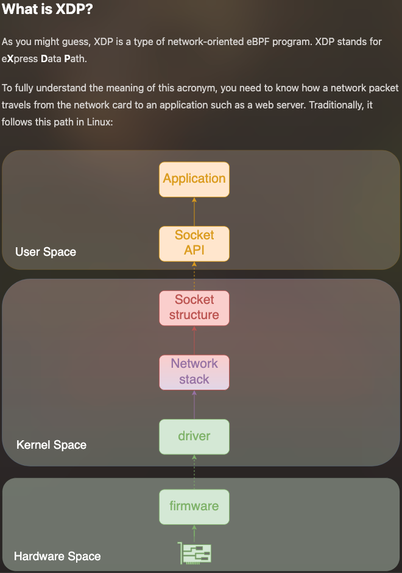

Before coding an eBPF uprobe program with Aya, you need to install dependancies. I created a Docker Image for that to save time.

<br>

In this tutorial, you only can use **Editor** tab.

First, on the host, create network environment namespaces:
```sh
setup-namespaces.sh
```{{exec}}

Launch this command in the Terminal at the bottom:

```sh
docker run --rm -it --name aya \
                    --privileged \
                    --network host \
                    -w /host/root/ \
                    -v /:/host \
                    -v /sys/kernel/debug:/sys/kernel/debug \
                    -v /var/run/netns:/var/run/netns \
                    -v /sys/fs/bpf/:/sys/fs/bpf/ \
                    littlejo/aya:3.0.1 bash
```{{exec}}

If you need to reset the environment:
1. Quit docker container (CTRL-D)
2. On the host, remove container namespaces:
```sh
teardown-namespaces.sh
```{{exec}}
3. On the host, recreate network environment namespaces:
```sh
setup-namespaces.sh
```{{exec}}
4. Relaunch the container:
```sh
docker run --rm -it --name aya \
                    --privileged \
                    --network host \
                    -w /host/root/ \
                    -v /:/host \
                    -v /sys/kernel/debug:/sys/kernel/debug \
                    -v /var/run/netns:/var/run/netns \
                    -v /sys/fs/bpf/:/sys/fs/bpf/ \
                    littlejo/aya:3.0.1 bash
```{{exec}}

* It can take a long time. During this time, you can install Rust extensions (in the OPEN VSX Registry) for the Editor:
  * Rust
  * Rust Syntax
  * Rust Extension Pack

Like that, in Rust code, you will see coloration of syntax.


If you have time, you can also read the article: [Observability for All Developers with uProbes](https://blog.littlejo.link/en/ebpf-another-type/xdp/intro/).


