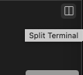

### 🧪 Testing xdp-tools inside the container

The container already comes with **xdp-tools** installed.
You can verify this by loading a simple XDP program on an interface:

```sh
xdp-filter load veth0
```{{exec}}

This command attaches a basic XDP program to the interface `veth0`.
It will display in the terminal any packets or events it intercepts — so you’ll see output when network traffic flows through that interface.


---

### 🪟 Open another terminal

To generate some traffic, open a **split terminal**:


Then, in this new terminal, send a few pings from the `lb` namespace:

```sh
ip netns exec lb ping -c 3 10.0.0.1
```{{exec}}

---

### 🔍 Check XDP program status

Back in the container, you can inspect which interfaces have an XDP program loaded:

```sh
xdp-filter status
```{{exec}}

---

### 🚫 Add a filter rule

Now, let’s block packets coming from the `lb` namespace (IP `10.0.0.10`):

```sh
xdp-filter ip -m src 10.0.0.10
```{{exec}}


---

### 🧾 Test the filtering

From the **host**, try pinging again:

```sh
ip netns exec lb ping -c 3 10.0.0.1
```{{exec}}

You should now see that the pings are **blocked** by the XDP filter.

---

### ♻️ Remove the filter

To delete the rule, use the `-r` (remove) option:

```sh
xdp-filter ip -r -m src 10.0.0.10
```{{exec}}

After that, the ping should succeed again.

---

### 🧹 Unload the XDP program

Finally, to detach the XDP program from the interface:

```sh
xdp-filter unload veth0
```{{exec}}
