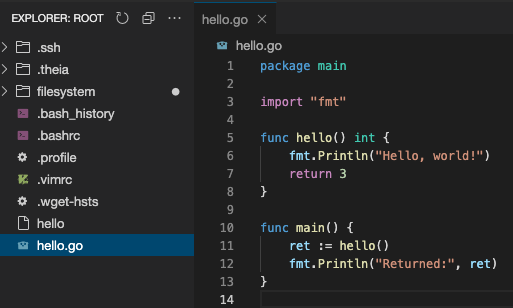
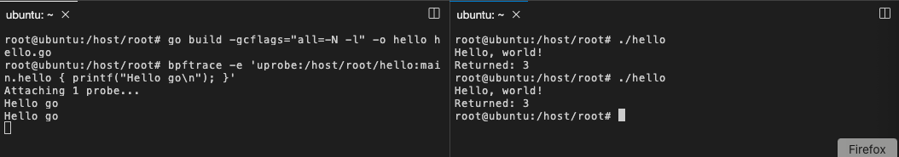

If you need to test golang program with uprobe program, golang compiler is already installed in the container.

Example:




Create a `hello.go` file:
```go
package main

import "fmt"

func hello() int {
    fmt.Println("Hello, world!")
    return 3
}

func main() {
    ret := hello()
    fmt.Println("Returned:", ret)
}
```{{copy}}


Compile the program:

```plain
cd /host/root/ # You change directory to the host volume
go build -gcflags="all=-N -l" -o hello hello.go
```{{exec}}

You can test with bpftrace:

```fish
bpftrace -e \
'uprobe:/host/root/hello:main.hello { printf("Hello go\n"); }'
```{{exec}}


In another terminal, execute the program :
```plain
./hello
```{{exec}}

and see what it happens for the eBPF bpftrace program.


