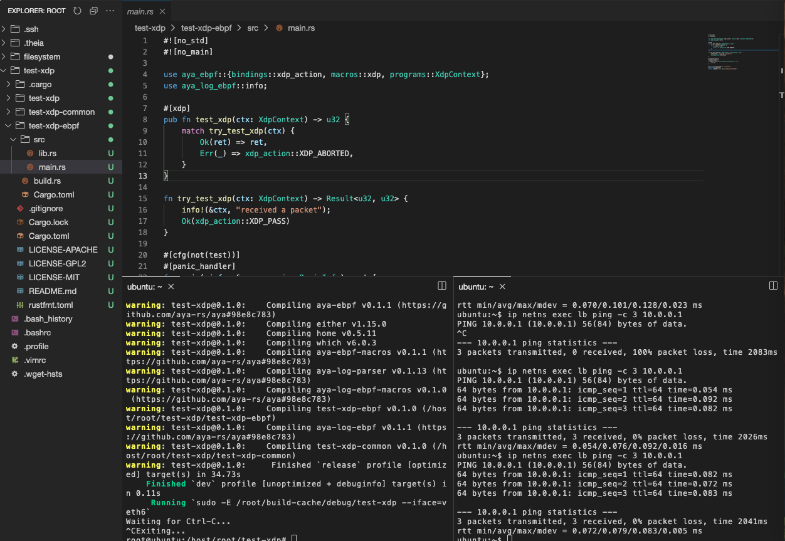

## In the container

Define some variables, for example:

```fish
name=test-xdp
program_type=xdp
iface_default=veth0
```{{exec}}

And launch:

```fish
cd /host/root/
cargo generate --name $name \
               -d program_type=$program_type \
               -d default_iface=$iface_default \
               https://github.com/aya-rs/aya-template

```{{exec}}

The Aya XDP program is generated. Now you have to compile and install:
```fish
cd $name
cargo run
```{{exec}}

Il you need to install xdp program in another interface you can type:
```fish
cargo run -- --iface=veth1
```{{exec}}

The work can start...

