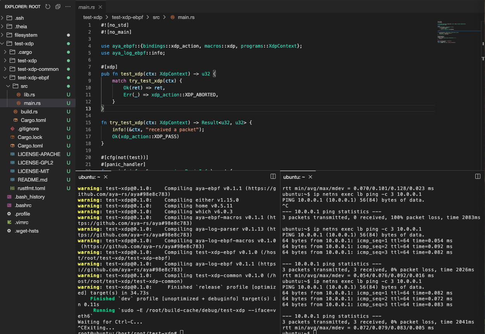

### 🧱 Define a few environment variables

Let’s start by defining a few environment variables:

```fish
name=test-xdp
program_type=xdp
iface_default=veth0
```{{exec}}

These variables define:
- the **name** of your Aya project (`test-xdp`)
- the **program type** (`xdp`)
- the **default network interface** (`veth0`)

---

### 🧩 Generate a new Aya project

Run the following command to create a new Aya XDP program template:

```fish
cd /host/root/
cargo generate --name $name \
               -d program_type=$program_type \
               -d default_iface=$iface_default \
               https://github.com/goya-rs/goya-template
```{{exec}}

This command uses the official [Goya template](https://github.com/goya-rs/goya-template) to scaffold a new XDP program project.

---

### ⚙️ Build and run your XDP program

Once generated, move into the project directory and compile it:

```fish
cd $name
task
```{{exec}}

This will build and load the XDP program onto the default interface (`veth0`).


Your first XDP program is now up and running — the real work begins!
```fish
ip netns exec lb ping 10.0.0.1
```{{exec}}




---

### 🔄 Load on another interface

If you want to attach your XDP program to a different interface (for example `veth1`), you can specify it with the `HOOK` option:

```fish
task HOOK=veth1
```{{exec}}

If you want to attach you XDP program to a different interface of a different namespace (for example `lb`):

```fish
ip netns exec lb task HOOK=veth6
```{{exec}}
